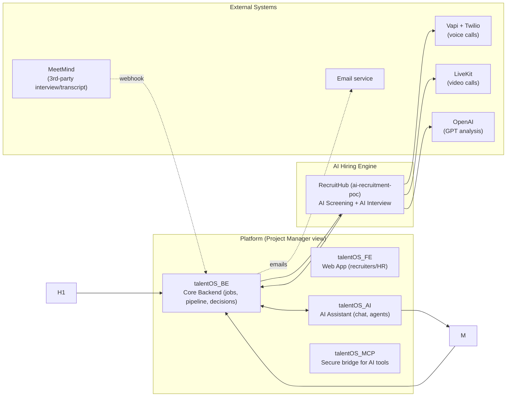
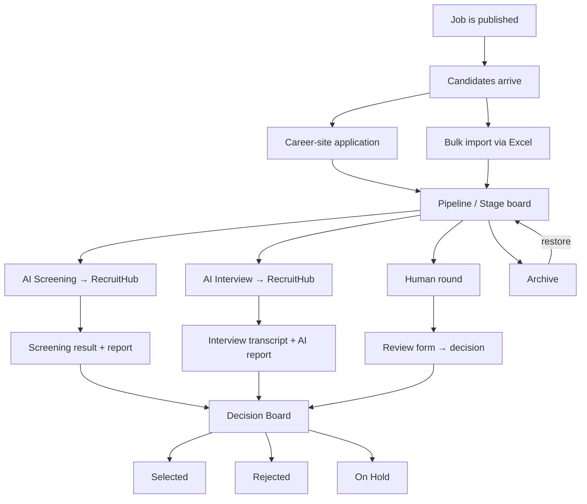
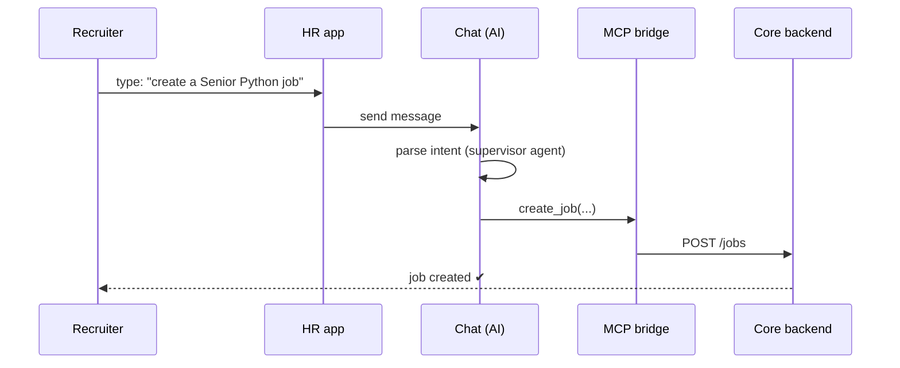
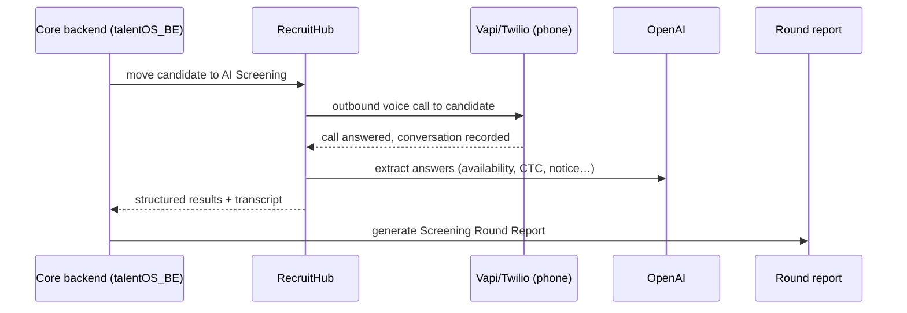
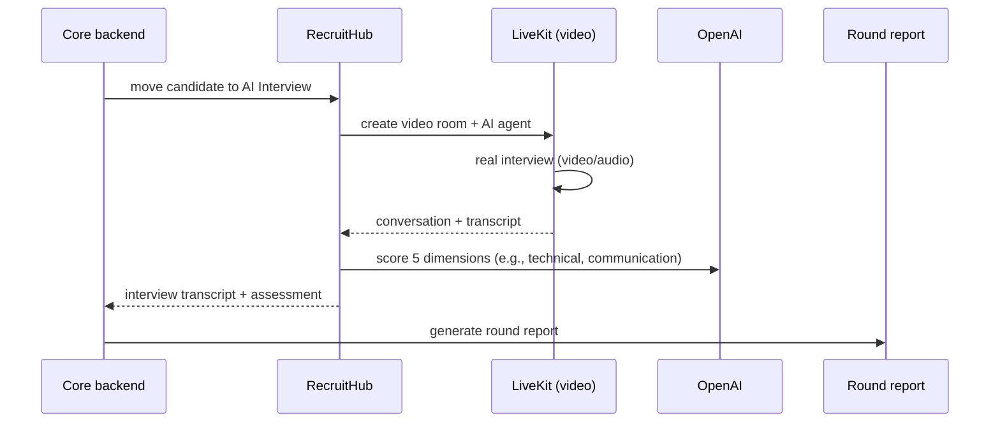
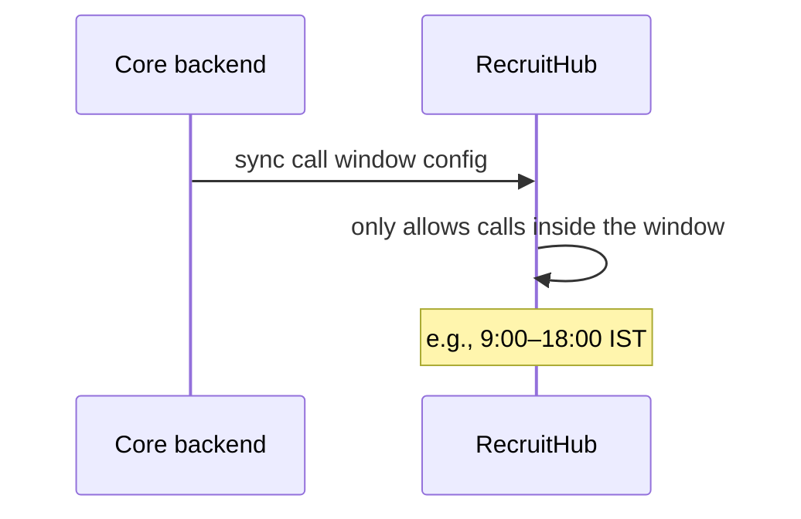
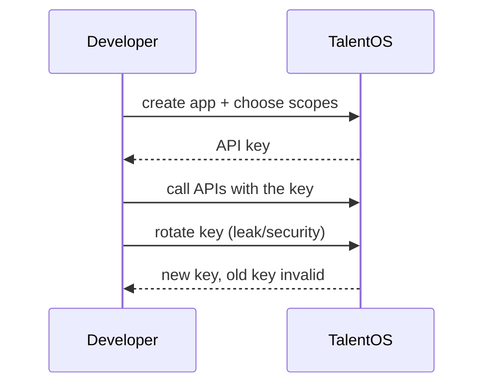

# talentOS — Architecture & Flow Guide

**Audience:** Project managers and non-technical stakeholders.
**Purpose:** Explain, at a high level, what the talentOS platform is made of, how the parts talk to each other, and how candidates move through the entire hiring lifecycle — from job post to final decision.
**Note:** This is a simplified view. Fine-grained technical details live in each service's own documentation.

---

## 1. The big picture

talentOS is a **hiring platform** that combines a core recruiting product (jobs, candidates, rounds, interviews, decisions) with **AI-powered screening and interviews** handled by a separate service called **RecruitHub** (code name `ai-recruitment-poc`).



**In simple terms:** recruiters use the web app → the backend runs the workflow → AI tasks run in RecruitHub (voice/video interviews) → results come back → humans review and decide → developers can plug into the platform with **App Keys**.

---

## 2. What each piece does

| Component | What it owns | Main technology |
|---|---|---|
| **talentOS_FE** (HR web app) | Screens recruiters/HR see: jobs, candidates, pipeline, interview design, decision board, ratings, users, settings, apps | React (TypeScript), Vite |
| **talentOS_BE** (core backend) | The source of truth: jobs/hiring requests, applications, rounds, interviews, slots, reviews, evaluations, interview design, **call windows**, decision board, roles & permissions, tenants, users, email, chat, **App Keys** | Python FastAPI, PostgreSQL, Redis, Kafka (async evaluation), APScheduler (cron jobs) |
| **talentOS_AI** (AI assistant) | Artificial intelligence chat/agents — job creation from text, review-question generation, resume evaluation, supervisor agents | Python (agents, LLM orchestration) |
| **talentOS_MCP** | A secure bridge that exposes core backend actions as "tools" the AI assistant can call | Python MCP server |
| **RecruitHub (`ai-recruitment-poc`)** | Voice (AI) Screening via phone calls and AI Video Interviews; pushes structured results back | Python FastAPI, Celery + Redis, OpenAI, Vapi/Twilio (voice), LiveKit (video) |
| **Meetcomm** (external) | Sends interview transcripts to talentOS after a human interview ends | 3rd-party |
| **App Keys** | Developers create apps, get API keys, choose which APIs their app may call | Backend API-key management |

---

## 3. The candidate journey (end-to-end)



The same candidate can appear in an AI Screening, then a human round, then an AI Interview — hiring teams choose the right route per candidate.

---

## 4. Job posting ("Create" | via Chat)

### 4.1 Create button (manual)
Jobs team clicks **Create Job** in the web app → the backend creates a **hiring request** → it shows up in the job list with skills, criteria, interview design.

### 4.2 Chat (AI-powered)
Recruiters can describe a job in plain text (e.g., "We need a senior Python engineer"). The AI assistant (talentOS_AI) uses the supervisor agent to understand the intent and the job agent to fill in job details, then calls the backend through the **MCP bridge** to actually create the job.



---

## 5. Candidate intake

| Entry path | How it works |
|---|---|
| **Career site** | Candidates apply through the public career website. Each application becomes a candidate record in the job's pipeline. |
| **Bulk (Excel)** | Hiring manager uploads an Excel file. The system imports many candidates at once (with de-duplication) into the job's pipeline. |

---

## 6. Candidate stage board & moves

Recruiters drive candidates through stages: New → AI Screening → AI Interview → Human round → Evaluated → Hired / Rejected.

- **Move to AI Screening** — candidate is handed to RecruitHub.
- **Move to AI Interview** — handed to RecruitHub.
- **Schedule human round** — slots + interview link + review form (see section 8).
- **Archive** — a candidate removed from the active board; the candidate can be **restored to the exact stage they were archived from** (nothing is lost).

> Who can move candidates? Admins, Job Owners and Recruiters. Reviewers can evaluate and reject but do not operate the pipeline (see **section 9**).

---

## 7. AI Screening → RecruitHub



Key points:
- RecruitHub calls the candidate's phone using an AI voice assistant.
- The AI asks a pre-designed series of questions (from the **interview design** for that job).
- GPT-4o extracts structured answers (availability, employment status, current/expected CTC, notice period, fit verdict).
- Results flow back into talentOS as a round report.

> **Interview design + Call Window** control both *what* is asked and *when* calls are allowed (see **section 9**).

---

## 8. AI Interview → RecruitHub

Same model as AI screening, but it is a **video** meeting:



The report includes a score breakdown, strengths/weaknesses, and a recommendation — piped back into the decision board.

---

## 9. Human round

1. **Slots** — Interviewer availability is captured (calendar).
2. **Link** — the candidate gets an interview link by email.
3. **Interview** — any preferred tool (MeetMind or similar).
4. **Review form** — once the round ends, a review form is shared with the interviewer for scoring.

    The questions in that review form are generated **in order of preference**:

    ```mermaid
    flowchart TD
        T[Is there interview transcript from MeetMind?] --Yes--> Q1[generate questions from transcript]
        T --No--> J[Do we have the Job Description?]
        J --Yes--> Q2[generate questions from JD]
        J --No--> Q3[fallback: static questions]
    ```

---

## 10. Decision board

All candidate outcomes land here in one place:

- **On Hold** — candidates still being considered.
- **Selected** — moved toward an offer.
- **Rejected** — not proceeding (with reason if HR provided one).

The board is the single view for the hiring team to see status everywhere.

---

## 11. Interview design & Call Window

- **Interview design** — the plan of questions/sections for a job, for both **AI Screening** and **AI Interview**. Questions can be designed manually and/or generated with AI.
- **Call Window** — a company-level (or job-level) setting that defines **when outbound AI screening calls are allowed**. This is authored in talentOS and **synced to RecruitHub** so RecruitHub only places calls inside the allowed window.



---

## 12. The 5 personas (simplified)

| Persona | Job the platform calls this |
|---|---|
| **Super Admin** | Platform administrator (TalentOS ops) |
| **Account Admin** | Workspace owner |
| **Job / Hirer** | "Job Owner" — the hiring manager (e.g., "interviewer") |
| **Recruiter** | Talent acquisition / day-to-day pipeline operator |
| **Reviewer** | Evaluator who scores & rates candidates |

| Capability | Super Admin | Account Admin | Job Owner | Recruiter | Reviewer |
|---|:--:|:--:|:--:|:--:|:--:|
| Create / edit / delete jobs | ✓ | ✓ | ✓ | ✗ | ✗ |
| Run the pipeline (move stages, schedule rounds) | ✓ | ✓ | ✓ | ✓ | ✗ |
| View & evaluate candidates | ✓ | ✓ | ✓ | ✓ | ✓ |
| Import candidates from Excel | ✓ | ✓ | ✓ | ✓ | ✗ |
| Design interview questions (edit + AI generate) | ✓ | ✓ | ✓ | ✗ | ✗ |
| Book interviewer slots | ✓ | ✓ | ✓ | ✓ | ✓ |
| Submit a review / rating | ✓ | ✓ | ✓ | ✓ | ✓ |
| Manage team members on a job | ✓ | ✓ | ✓ | ✗ | ✗ |
| Manage organisation settings | ✓ | ✓ | ✗ | ✗ | ✗ |
| Manage users (invite / change roles) | ✓ | ✓ | ✗ | ✗ | ✗ |
| Manage **App Keys** (apps/APIs) | ✓ | ✓ | ✗ | ✗ | ✗ |
| Platform settings (tenants, roles) | ✓ | ✗ | ✗ | ✗ | ✗ |

✓ = can do · ✗ = cannot do (page/button is hidden) · **Pipeline** = move candidates between stages, schedule/cancel rounds.

> Note: In the codebase, "Job Owner" is used for the persona that hires/interviews for a job. If your PM list calls this "Job Surveyor / Interviewer", they map however you set.

---

## 13. Developer integration — App Keys

Developers can integrate with talentOS without touching the UI:

1. **Create an App** in the **Apps / API keys** dashboard.
2. talentOS issues an **API key** (secret) to that app.
3. From a dashboard, the developer **chooses which APIs the app can use** (purpose/spec generic scope on the app).
4. Keys can be **rotated at any time** (e.g., if a key leaks) — old key dies, new key issued without other parts changing.
5. Every in-bound call from the app is authenticated against the app's key and scope.



---

## 14. Technology at a glance

| Layer | Used |
|---|---|
| Frontend | React 19 + TypeScript + Vite (+ TanStack Query) |
| Core backend | Python FastAPI • PostgreSQL • Redis • Kafka (async evaluations + DLQ) • APScheduler cron |
| AI assistant | talentOS_AI (FastAPI) + talentOS_MCP bridge |
| AI hiring | RecruitHub: FastAPI • Celery + Redis • **OpenAI (GPT-4o)** • Vapi/Twilio (voice) • Deepgram (speech-to-text) |
| Video interviews | LiveKit (rooms, recording, AI agent) |
| External integrations | MeeetMind (transcripts) • Email • Google login |
| Developer API | App Keys with scoped access + rotation |

---

